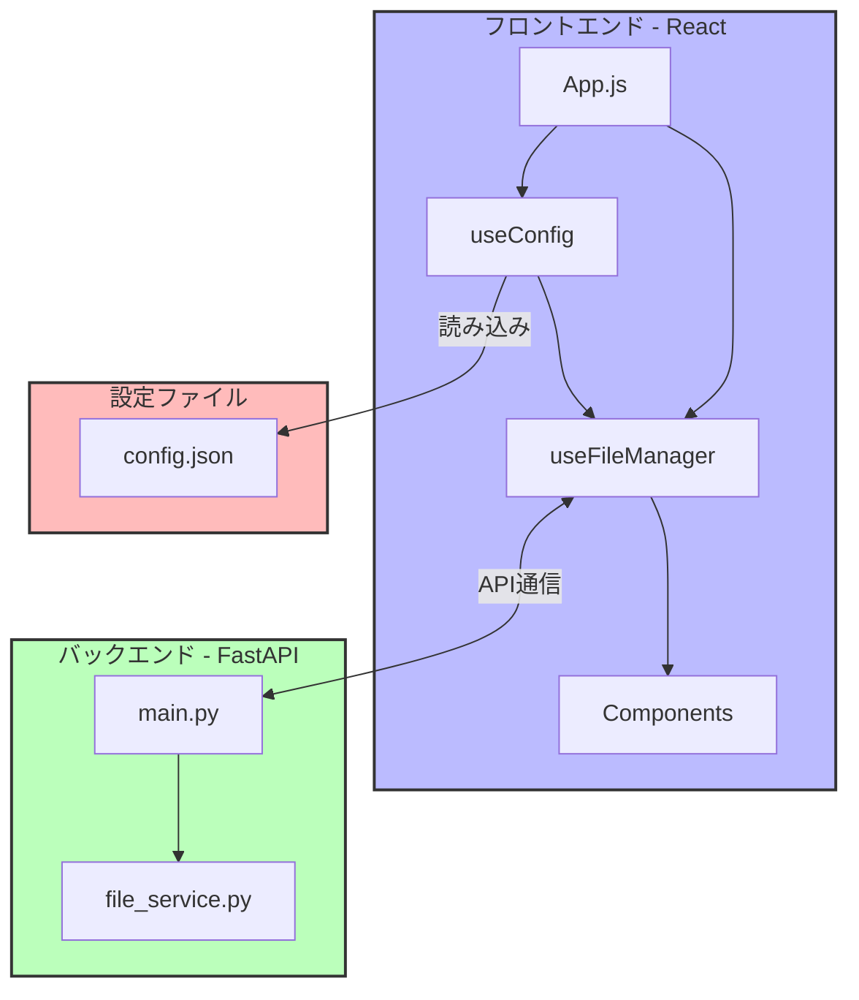
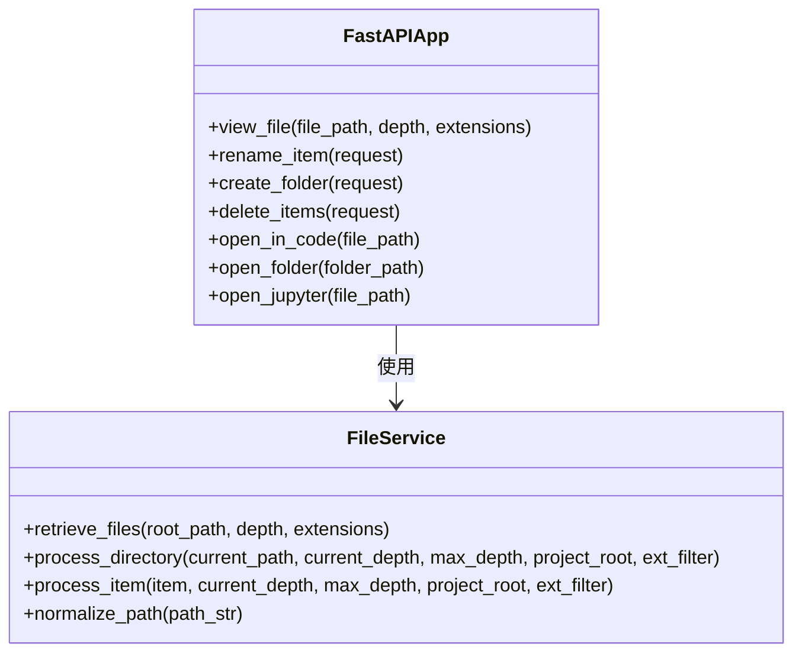
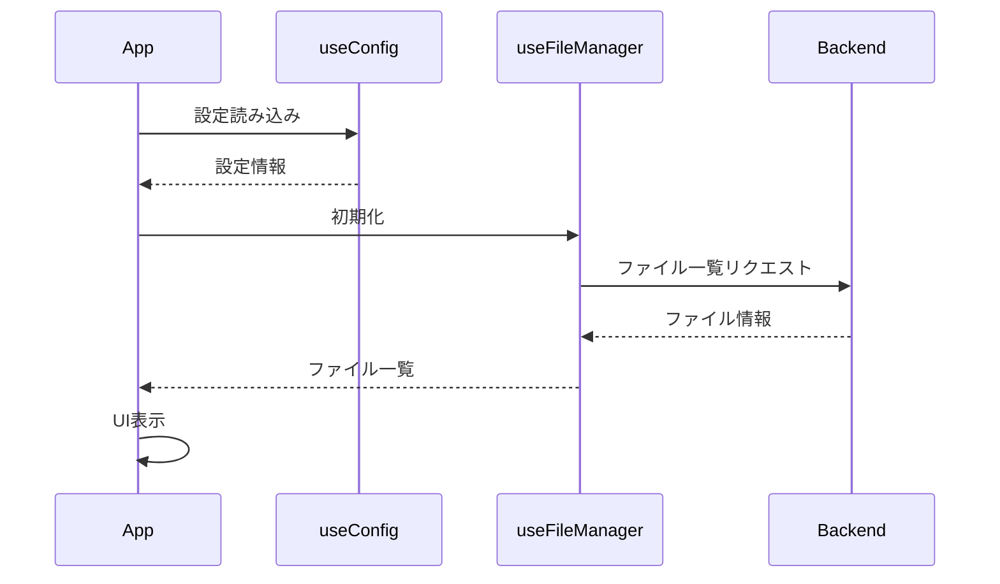

# ローカルファイル管理システム 開発者ガイド

## プロジェクト概要

このアプリケーションは、ローカルファイルシステムをブラウザから閲覧・管理するためのWebアプリケーションです。
フロントエンドはReact、バックエンドはPython（FastAPI）で構築されています。

## システム構成



## ディレクトリ構造

```
web_file_manager/
├── backend/                 # バックエンドコード
│   ├── file_service.py      # ファイル処理ロジック
│   ├── main.py              # FastAPIアプリケーション
│   └── requirements.txt     # Pythonパッケージ依存関係
├── frontend/                # フロントエンドコード
│   ├── build/               # ビルド済みファイル
│   ├── public/              # 静的ファイル
│   │   ├── config.json      # 設定ファイル
│   │   └── index.html       # HTMLテンプレート
│   ├── src/                 # ソースコード
│   │   ├── components/      # Reactコンポーネント
│   │   ├── constants/       # 定数定義
│   │   ├── hooks/           # カスタムフック
│   │   ├── App.js           # メインアプリケーション
│   │   └── index.js         # エントリーポイント
│   ├── package.json         # NPM設定
│   └── package-lock.json    # NPM依存関係ロック
├── docs/                    # ドキュメント
│   ├── images/              # 画像ファイル
│   ├── user_guide.md        # ユーザーガイド
│   └── developer_guide.md   # 開発者ガイド
└── README.md                # プロジェクト概要
```

## 技術スタック

- **フロントエンド**:
  - React: UIライブラリ
  - Material-UI: UIコンポーネント
  - Axios: HTTP通信

- **バックエンド**:
  - FastAPI: Webフレームワーク
  - Uvicorn: ASGIサーバー
  - Pathlib: ファイルパス操作

## 主要コンポーネント解説

### バックエンド

#### main.py

FastAPIアプリケーションのメインファイルです。以下のエンドポイントを提供します：

- `GET /view_file`: ファイル・ディレクトリ情報の取得
- `POST /rename`: ファイル・ディレクトリのリネーム
- `POST /create-folder`: フォルダ作成
- `POST /delete-items`: ファイル・ディレクトリの削除
- `POST /open-in-code`: VS Codeでファイルを開く
- `POST /open-folder`: OSのファイルエクスプローラでフォルダを開く
- `POST /open-jupyter`: Jupyter Notebookでファイルを開く



#### file_service.py

ファイルシステム操作を担当するモジュールです。主な機能：

- ファイル・ディレクトリの再帰的な取得
- ファイル情報の取得（名前、サイズ、パスなど）
- 拡張子フィルタリング
- パス正規化（Windows/Mac/Linux間の互換性）

### フロントエンド

#### App.js

アプリケーションのメインコンポーネントです。UIレイアウトと各コンポーネントの配置を担当します。

#### hooks/useConfig.js

設定ファイル（config.json）を読み込むカスタムフックです。以下の機能を提供します：

- 設定ファイルの非同期読み込み
- OS検出によるデフォルトパスの調整
- エラーハンドリングとフォールバック設定

#### hooks/useFileManager.js

ファイル管理のロジックを担当するカスタムフックです。主な機能：

- ファイル一覧の取得と表示
- ディレクトリナビゲーション
- ファイル検索
- 拡張子フィルタリング



## 開発環境のセットアップ

### 必要条件

- Python 3.8以上
- Node.js 14以上
- npm 6以上

### バックエンド開発

1. 依存関係のインストール:
   ```bash
   cd backend
   pip install -r requirements.txt
   ```

2. 開発サーバーの起動:
   ```bash
   uvicorn main:app --reload --host 0.0.0.0
   ```

3. API ドキュメントの確認:
   ブラウザで `http://localhost:8000/docs` にアクセス

### フロントエンド開発

1. 依存関係のインストール:
   ```bash
   cd frontend
   npm install
   ```

2. 開発サーバーの起動:
   ```bash
   npm start
   ```

3. ブラウザで `http://localhost:3000` にアクセス

## ビルドと本番デプロイ

### フロントエンドのビルド

```bash
cd frontend
npm run build
```

ビルド結果は `frontend/build` ディレクトリに出力されます。

### 本番環境での設定

1. `frontend/build/config.json` を編集して環境に合わせた設定を行います:
   ```json
   {
     "defaultPath": "/path/to/default/directory",
     "apiUrl": "http://your-backend-server:8000"
   }
   ```

2. バックエンドサーバーを起動:
   ```bash
   cd backend
   uvicorn main:app --host 0.0.0.0
   ```

3. フロントエンドのビルドファイルをウェブサーバー（Nginx, Apache等）で配信

## クロスプラットフォーム対応

### Windowsでの注意点

- パスの区切り文字がバックスラッシュ（`\`）
- JSONファイル内ではバックスラッシュをエスケープする必要あり（`\\`）
- ネットワークパス（`\\server\share`）の特別な処理

### Macでの注意点

- パスの区切り文字がスラッシュ（`/`）
- 隠しファイル（`.DS_Store`など）の扱い

## 拡張と改善のアイデア

1. **認証機能**: ユーザー認証を追加してセキュリティ強化
2. **ファイルプレビュー**: テキスト、画像、PDFなどのプレビュー機能
3. **ドラッグ&ドロップ**: ファイルのドラッグ&ドロップによる操作
4. **ファイルアップロード**: ブラウザからファイルをアップロード
5. **テーマ切替**: ダークモード/ライトモード対応

## トラブルシューティング

### CORS関連の問題

フロントエンドとバックエンドが異なるオリジンで実行されている場合、CORS設定が必要です。
`main.py` の CORS ミドルウェア設定を確認してください。

### パス関連の問題

異なるOSでパスの扱いが異なるため、`file_service.py` の `normalize_path` 関数が正しく動作しているか確認してください。

### ビルド関連の問題

`npm run build` 後にアプリが動作しない場合、`config.json` の設定とAPIのURLが正しいか確認してください。
