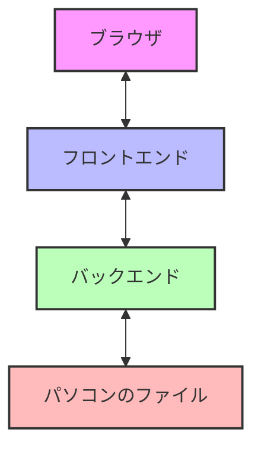
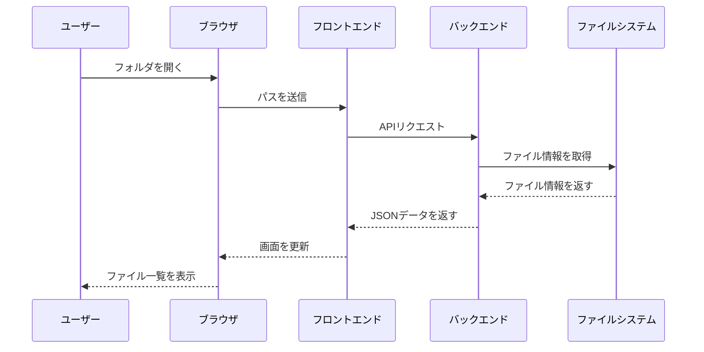
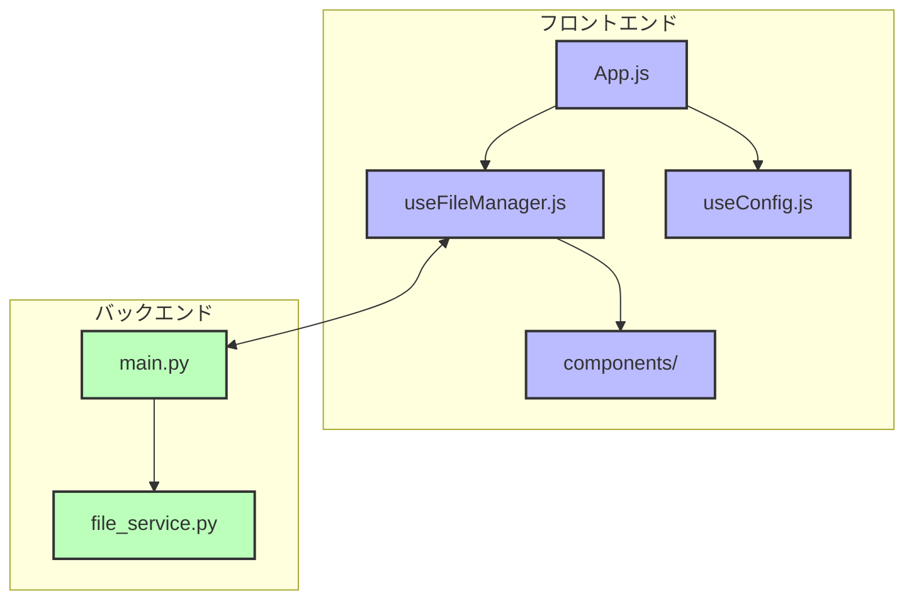

# ローカルファイル管理システム 使い方ガイド

## はじめに

このアプリは、パソコン内のファイルやフォルダを、ブラウザから簡単に見たり管理したりできるツールです。
写真や文書など、いろいろなファイルを整理するのに役立ちます。


## アプリでできること

- 📂 フォルダの中身を見る
- 🔍 ファイルを名前で検索する
- 🖼️ 画像ファイルを管理する
- 📝 VS CodeやJupyter Notebookでファイルを開く

## アプリの使い方

### 1. アプリを起動する

アプリを使うには、次の2つのプログラムを起動する必要があります：

1. **バックエンド**（データを管理する部分）
2. **フロントエンド**（画面を表示する部分）

#### バックエンドの起動方法

1. コマンドプロンプト（Windowsの場合）またはターミナル（Macの場合）を開きます
2. 次のコマンドを順番に入力します：

```bash
cd backend
pip install -r requirements.txt
uvicorn main:app --reload --host 0.0.0.0
```

#### フロントエンドの起動方法

1. 別のコマンドプロンプトまたはターミナルを開きます
2. 次のコマンドを順番に入力します：

```bash
cd frontend
npm install
npm start
```

3. 自動的にブラウザが開き、アプリが表示されます
4. もし自動で開かない場合は、ブラウザで `http://localhost:3000` にアクセスしてください

### 2. ファイルを見る

1. 画面上部の「パス」欄に、見たいフォルダのパスを入力します
   - Windowsの場合：`C:\Users\あなたの名前\Documents`
   - Macの場合：`/Users/あなたの名前/Documents`

2. フォルダをクリックすると、そのフォルダの中に入ります
3. 「戻る」ボタンで前のフォルダに戻れます

### 3. ファイルを検索する

1. 検索バーに探したいファイル名を入力します
2. 検索結果が表示されます

### 4. フィルターを使う

画面中央のボタンで、特定の種類のファイルだけを表示できます：

- 📄 文書（Word、Excel、PDFなど）
- 🖼️ 画像（JPG、PNG、GIFなど）
- 🎬 動画（MP4、AVIなど）
- 🎵 音楽（MP3、WAVなど）
- 📊 データ（CSVなど）

### 5. 外部アプリでファイルを開く

ファイルを右クリックすると、次のことができます：

- VS Codeで開く
- フォルダを開く
- Jupyter Notebookで開く

## アプリの仕組み

このアプリは、次のような仕組みで動いています：



1. **ブラウザ**：あなたが見ている画面です
2. **フロントエンド**：見やすい画面を作る部分です（React）
3. **バックエンド**：パソコンのファイルを読み取る部分です（Python）
4. **パソコンのファイル**：実際のファイルやフォルダです

## よくある質問

### Q: Windowsで動かすとエラーが出る場合は？

A: パスの書き方が違う可能性があります。Windowsでは `\` （バックスラッシュ）を使います。例：`C:\Users\名前\Documents`

### Q: 設定を変更するには？

A: `frontend/public/config.json` ファイルを編集します：

```json
{
  "defaultPath": "最初に表示するフォルダのパス",
  "apiUrl": "バックエンドのURL（通常は変更不要）"
}
```

- Windowsの場合は `C:\\Users\\名前\\Documents` のように `\` を二重にします

### Q: 本番環境で使うには？

A: 次のコマンドでビルドします：

```bash
cd frontend
npm run build
```

`frontend/build` フォルダの中身をウェブサーバーに置きます。

## データの流れ

アプリでファイルを表示するときのデータの流れは次のとおりです：



## トラブルシューティング

### バックエンドが起動しない場合

1. Pythonがインストールされているか確認する
2. 必要なパッケージがインストールされているか確認する：
   ```bash
   pip install fastapi uvicorn aiofiles
   ```

### フロントエンドが起動しない場合

1. Node.jsがインストールされているか確認する
2. 必要なパッケージがインストールされているか確認する：
   ```bash
   npm install
   ```

### ファイルが表示されない場合

1. パスが正しいか確認する
2. バックエンドが起動しているか確認する
3. ブラウザのコンソールでエラーを確認する（F12キーを押して「Console」タブを見る）

## 開発者向け情報

アプリの構成は次のようになっています：



### 主要なファイル

- **フロントエンド**
  - `App.js`: メイン画面
  - `useFileManager.js`: ファイル管理のロジック
  - `useConfig.js`: 設定読み込み
  - `components/`: 画面の部品

- **バックエンド**
  - `main.py`: APIエンドポイント
  - `file_service.py`: ファイル処理
